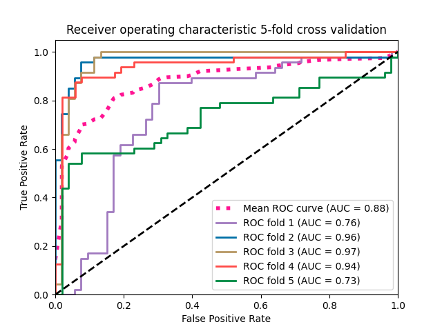
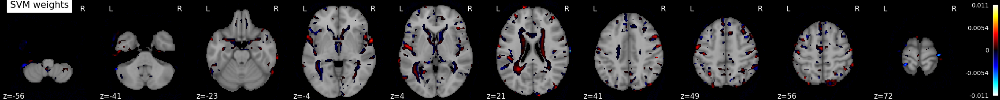

# SVM_MRI_Classification

## Citation
If you are using this repository, please cite this article
**Li Q, Yang MQ. 2021. Comparison of machine learning approaches for enhancing Alzheimer’s disease classification. PeerJ 9:e10549 https://doi.org/10.7717/peerj.10549**

### Receiver Operating Characteristic (ROC) with cross validation

### SVM heatmap
Visualize the results
Look at the SVC’s discriminating weights

